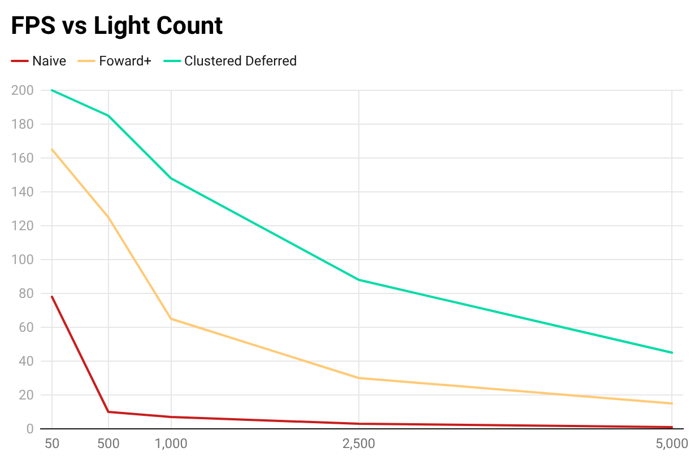
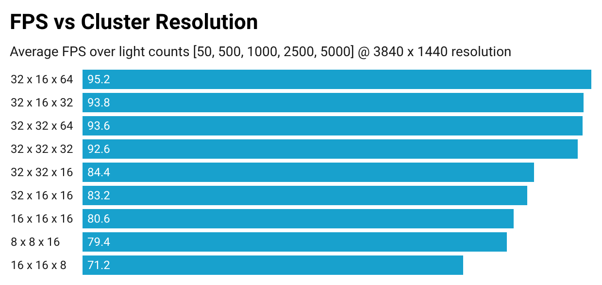

WebGPU Forward+ and Clustered Deferred Rendering
======================

A high-performance WebGPU renderer implementing Forward+ and Clustered Deferred shading to scale to thousands of dynamic lights.

[**Live Demo**](http://seabiscuit-iv.github.io/Project4-WebGPU-Forward-Plus-and-Clustered-Deferred)

## Implementation

The clustered rendering technique comes down to dividing your render space into exhaustive volumetric **clusters** and creating a **light list** for each, which consists of references to lights that have any contribution to that cluster's volumetric area. Then in any further lighting calculations, the corresponding light list can be used instead of iterating over the global light list. This can significantly reduce the number of lights iterated on per render-item, and also comes with the added bonus of free light frustum culling.

This project features two separate render pipelines for Foward+ and Deferred Clustered shading. Some logic, like the light clustering process, is shared between the renderers. 

### Light Clustering

Light clustering code is in following files:

 - `stage/lights.ts`
 - `shaders/clustering.wgsl`

Our clusters are defined as frustum-aligned voxels, often called **froxels**. The froxels $x$ and $y$ compoenents are defined similarly, with the screen-space plane being split into equally-spaced tiles (which expand along the frustum with depth). The $z$ depth component is slightly more complex, as equally diving the near-far planes in screen space would result in exponential spacing in world space (occasionally desirable, but not in this project). To account for this, we must be able to linearize and un-linearize our depth, which is done with this formula:

$$
  z_{linear} =  \frac{near \cdot far}{far - z \cdot (far - near)} 
$$

Getting an object's cluster requires calculating the world-space depth by linearizing the given depth and interpolating the near-far planes. The light contribution checks are done in world space, so getting the froxel positions in world-space are done in the opposite way. In our case, we actually have to project back and forth twice because we use a smaller max depth for the froxels than the far-clip plane. 

We use a compute pass prior to the final draw to compute the visible light list for each froxel in parallel. Each froxel loops over the entire light list and decides its light contribution through standard sphere-box intersection, and then stores it in a single storage buffer.

### Foward+ 

The Foward+ implementation is found in the following files:

 - `renderers/foward_plus.ts`
 - `shaders/foward_plus.fs.wgsl`

The Forward+ renderer simply calculates the enclosing froxel for a given fragment and references its corresponding light list from the storage buffer, using it for light calculations instead of a global light list. Calculating the cluster is just as simple as truncating the $x$, $y$, and linearized $z$ to the nearest cluster bound. 

### Clustered Deferred

The Clustered Deferred implementation is found in the following files:

 - `renderers/clustered_deferred.ts`
 - `shaders/clustered_deferred.fs.wgsl`
 - `shaders/clustered_deferred_fullscreen.vs.wgsl`
 - `shaders/clustered_deferred_fullscreen.fs.wgsl`

The Clustered Deferred renderer just combines this clustered lighting approach with a deferred renderer. It replaces the renderer with a **geometry prepass** that renders out visible geometry information, and then does lighting calculations and displays the final image in a **lighting pass**.

## Performance Analysis

This section evaluates the performance characteristics of the Naive forward, Forward+, and Clustered Deferred rendering pipelines under varying scene conditions. All measurements are taken under controlled settings with fixed camera parameters, focusing on how each approach scales with light count, screen resolution, and cluster grid configuration.

### FPS vs Light Count

  

This plot illustrates the expected increase in FPS as the renderer transitions from naive forward rendering to Forward+ and then to Clustered Deferred shading, reflecting progressively more effective light culling.

### FPS vs Screen Resolution

  

This plot demonstrates the expected scaling behavior with respect to screen resolution. Because the number of clusters in the Forward+ and Clustered Deferred renderers remains fixed, increasing the resolution raises the number of pixels per cluster. As a result, the cost of light culling is amortized over more fragments, allowing both clustered approaches to scale more favorably than naive forward rendering.

### FPS vs Cluster Resolution

  

Cluster resolution has a significant impact on performance and represents one of the most sensitive tuning parameters in a clustered rendering pipeline. The results indicate that more uniformly shaped clusters generally yield better performance by balancing light list precision against culling overhead. Cluster resolutions are expressed in an $x 
\times y \times z$ format, corresponding to subdivisions in view-space.

Among the configurations tested, a resolution of  $32 \times 16 \times 64$ achieved the best overall performance. This configuration aligns with the renderer’s 16:9 aspect ratio while allocating greater subdivision along the depth axis, where scene complexity and light distribution tend to vary most significantly. These results highlight the importance of emphasizing depth slicing in clustered renderers to achieve optimal scalability and consistent performance.

### Conclusions

Our performance analysis confirms the expected scalability of the three rendering techniques. Naive forward rendering exhibits diminishing performance with increasing light counts, making it unsuitable for scenes with large numbers of dynamic lights. Forward+ significantly improves performance by introducing screen-space light culling, while Clustered Deferred rendering provides the most consistent performance, reducing light costs through a depth prepass. 

Cluster resolution is shown to be a critical tuning parameter for clustered rendering. The optimal configuration demonstrates that allocating greater resolution along the $z$ axis is particularly effective for real-world scenes, where light distribution and geometric complexity vary most significantly with depth.

Overall, these results highlight the effectiveness of GPU-driven light culling and clustered shading techniques for achieving scalable, predictable performance in real-time rendering pipelines, particularly in scenarios with high light counts and complex scenes.

## Build and Run Instructions

Follow these steps to install and view the project:
- Run `npm install` in the root directory of this project to download and install dependencies
- Run `npm run dev`, which will open the project in your browser

## Future Work

### Adaptive Cluster Sizing

Dynamically adjusting cluster resolution based on depth complexity or screen-space density. This would improve performance in scenes with uneven geometry or non-uniform light distribution by allocating resources where they are most needed.

### Light Culling Effectiveness

Implementing more advanced GPU-driven light culling strategies, such as per-cluster importance or compacted light lists. This could reduce overhead and further lower the number of unnecessary light evaluations per pixel.

Furthermore, collecting performance data for light list counts and comparing them to global light counts would be ideal.

### Additional Lights

Extending the renderer to handle area lights or volumetric light sources. This would test scalability and highlight the benefits of clustered shading in more complex scenes.

### Hybrid Pipeline

Combining Forward+ for transparent objects with Clustered Deferred for opaque geometry. This would allow the renderer to maintain high-quality visuals while maximizing performance in mixed-material scenes.   

## Acknowledgements

### University of Pennsylvania, CIS 565: GPU Programming and Architecture, Project 4

* Saahil Gupta
* Tested on: **Zen Browser 1.16.4b** on
  Windows 11 10.0.26100, AMD Ryzen 9 7940HS @ 4.0GHz 32GB, RTX 4060 Laptop GPU 8GB

### References
 - [Forward+: Bringing Deferred Lighting to the Next Level](https://takahiroharada.wordpress.com/wp-content/uploads/2015/04/forward_plus.pdf)
 - [WebGPU API Specification](https://developer.mozilla.org/en-US/docs/Web/API/WebGPU_API)

### Technologies

- [Vite](https://vitejs.dev/)
- [loaders.gl](https://loaders.gl/)
- [dat.GUI](https://github.com/dataarts/dat.gui)
- [stats.js](https://github.com/mrdoob/stats.js)
- [wgpu-matrix](https://github.com/greggman/wgpu-matrix)